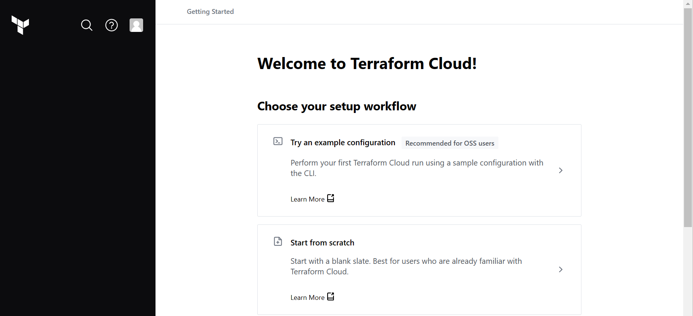
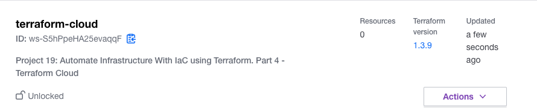
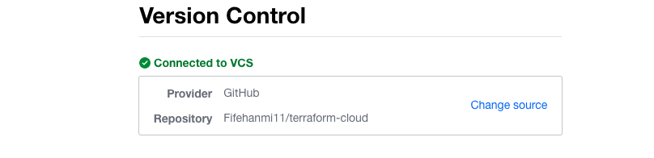
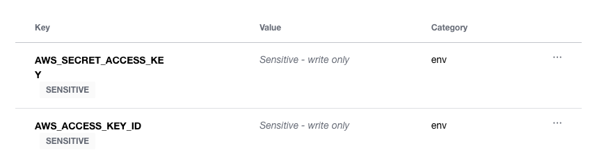
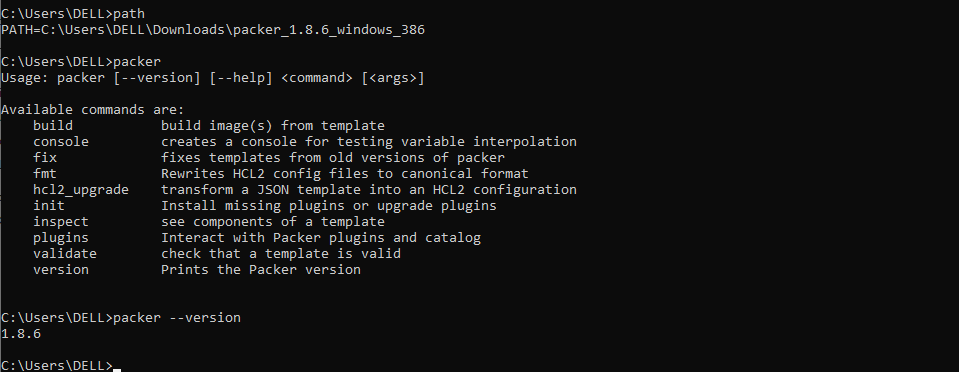
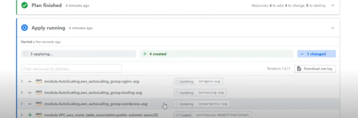
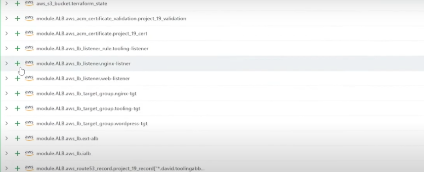

# AUTOMATE INFRASTRUCTURE WITH IAC USING TERRAFORM PART 4 - Terraform Cloud

## Created a Terraform Cloud account

## Configured a workspace
- Selected version control workflow
- Selected the terraform-cloud repository created on git

## Created Terraform Cloud repository on Github

## Configured Variables 
- Configured environmemt variables AWS_ACCESS_KEY_ID and AWS_SECRET_ACCESS_KEY

## Packer
- Installed packer
- Added packer to Path

### Ansible
- Setup Ansible

- Ran terraform apply and terraform plan

- Tested automated terraform plan
